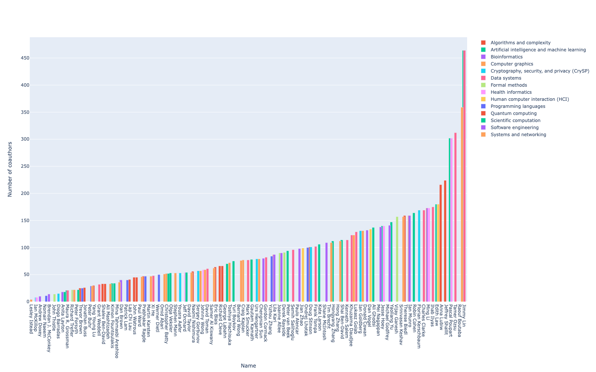
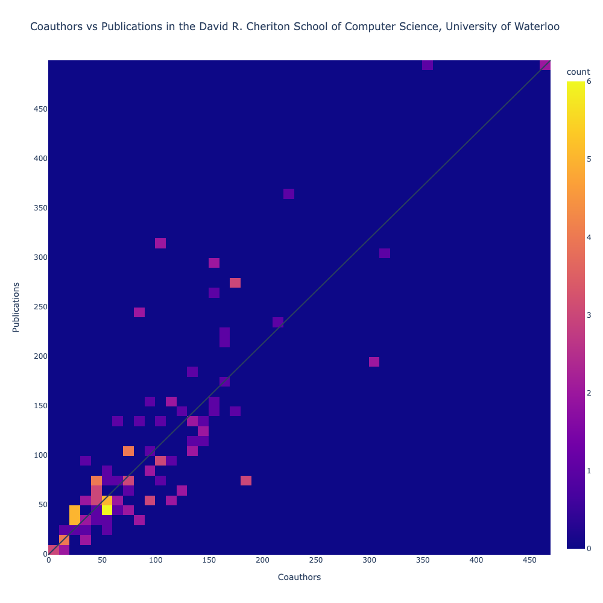

Two visualizations were constructed to illustrate collaboration in the David R. Cheriton School of Computer Science, University of Waterloo.

For a full, detailed notebook containing all the code involved in this project, or to re-generate results yourself, see `all-work-detailed.ipynb`. 

For a more concise notebook containing only the code pertinent to producing the visualizations, see `collaboration_in_UW_CS.ipynb`. This file is also available on *Google Colab* [here](https://colab.research.google.com/drive/1VovutAP3O57j5IFfqUWUcIKIwaYBglpj?usp=sharing).

Here is a (non-interactive) example of the first visualization.

*Question*:
Who are the top collaborators in our department? In our individual research areas? When I refer to collaboration, I mean coauthorship with any individual, *not necessarily within the University of Waterloo*.

These are the people you want to strike up a conversation with if you’re looking to increase your publications.

*Method*: 
I scraped the various research area pages for the David R. Cheriton School of Computer Science manually - https://cs.uwaterloo.ca/research/research-areas - to obtain the list of faculty members in each research area. 

I used these lists of names to ask DBLP for each person's DBLP URL, then used this URL in a second query to collect the number of distinct co-authors listed for each person.

This visualization allows you to drill down and see results per a specific research area. 

*Findings*:
- I found that data systems was the most collaborative research area, which makes sense as its probably the most broadly-defined research area, with the most room for overlap with other research areas.
- Professor Jimmy Lin is the most collaborative overall. To prove I didn't fudge the data for bonus points, here is his DBLP profile. Note that he appears to have broken the coauthor network, which is admittedly a work in progress and "still far from perfect" (https://dblp.org/pid/00/7739.html).
- Professor Craig Kaplan, one of my supervisors, the most collaborative in my research area of computer graphics.

*Issues encountered*:
- Multiple authors may have the same name.
    - I relied on affiliation for this.
    - some professors have common names that aren’t returned in the first 30 results. I bumped it up to 1000, which is the max, but in theory, this could still prove inadequate.
- Affiliations are stored by DBLP in the form of notes, which may be dictionaries or lists depending on how many affiliations an author has.
    - For robustness, I needed my code to handle both
- DBLP doesn’t always contain all of a person’s publications and is thus not always a good indicator of number of co-authors. DBLP "focuses exclusively on publications in (core) computer science," so "proceedings or journal volumes beyond the scope of dblp may very well never be added." (https://dblp.org/faq/How+can+I+enter+my+publications+to+dblp.html)
- Some authors are part of more than one research area, e.g., Peter Buhr, who is in both Systems and networking and programming languages. It is not currently possible to order by anything other than category name or total (the sum of all the heights in the group). But the total for Peter Buhr would be twice his true number of collaborators. So rather than sorting by total, I had to export the results to Excel, remove duplicates and thereby manually obtain the true order, then provide the author names in a list for custom sorting.

Here is a (non-interactive) example of the second visualization.

*Question*: My next question was: how does this collaboration impact publication? Does collaborating more generally correlate with more publications? Less? 

*Method*: Heat map comparing number of publications with number of coauthors. 
Four quadrants correspond to four possibilities of where most points are clustered. 
Do most people:
1. collaborate a lot and publish a lot?
2. collaborate a lot and publish little?
3. collaborate little and publish a lot?
4. collaborate little and publish little?

Note that you can adjust the granularity by using the bin size slider (the more bins, the fewer the data points inside each bin). A diagonal line splits the figure in half. In the segment above the diagonal line, people have more publications than coauthors. This is generally indicative of less collaboration. In the segment below the diagonal line, people have more coauthors than publications. This is generally indicative of more collaboration. 

You can also view results by research area, as before.

As a sanity check, we search for professor Jimmy Lin in this second visualization. The first visualization tells us he has 464 coauthors. He stands out right away in the second visualiation, with 495 publications. Terrifying.

*Findings*:
The results are consistent with intuition. There appears to be a positive linear corelation between publications and coauthors, since, as coauthors increase, publications must necessarily also be increasing. Note that the inverse relationship isn't true; an increase in publications doesn't imply an increase in coauthors, as people could choose to publish within their existing collaboration network rather than branching out to others outside that network.
Nevertheless, the relationship between the dependent variable, publications, and in the independent variable, coauthors, is not directly proportional, or 1:1. The ratio depends on the number of coauthors on a published paper, which is in constant flux. That's what makes this analysis interesting; some people collaborate with many coauthors on a paper while others collaborate with fewer.

Most people fall into category 4, with what appears to be a slight trend towards heads-down work with limited collaboration. Indicating this, you can see slightly more datapoints above the diagonal line.

One noteworthy result is that the Cryptography, security, and privacy (CrySP) research area tends to collaborate quite heavily, with most people in this group having far more unique coauthors than they do papers. 

*Issues encountered*:
Limitations are largely the same as for the first visualization.

The small number of people in each research area makes the per-research-area results generally less interesting. For example, there are only 3 data points for Quantum computing because there are only 3 members listed here: https://cs.uwaterloo.ca/research/research-areas/quantum-computing! As a future extension, this project could use a larger dataset.